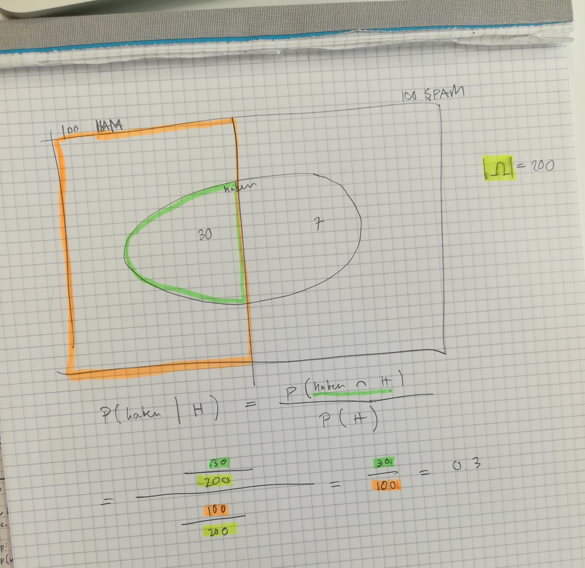

Spam-Filter
===

Projekt von Michael Hauser und Hasan Kara

# Probleme
Da wir eine hohe Anzahl Zahlen zwischen 0 und 1 miteinandner multiplizieren 
(z.B. beim Berechnen der gesamt Spam-Wahrscheinlichkeit einer Vakanz) kommen wir auf 
ungewünschte Resultate.

# Precision and Recall
Um einen optimalen Alpha Wert zu erhalten, der als Threshold gilt, ob ein 
Mail Spam oder nicht ist, haben wir den Alpha Wert iterierden erhöht und für jede Iteration 
die Performance des Classifiers bemessen.  
Die Perfomance wurde mittels des F1-scores ermittelt.

# Unsere Überlegungen
Unsere Überlegung zum Berechnen der Spam-wahrscheinlichkeit eines einzelnen Wortes 
wird durch folgende Grafik illustriert.

